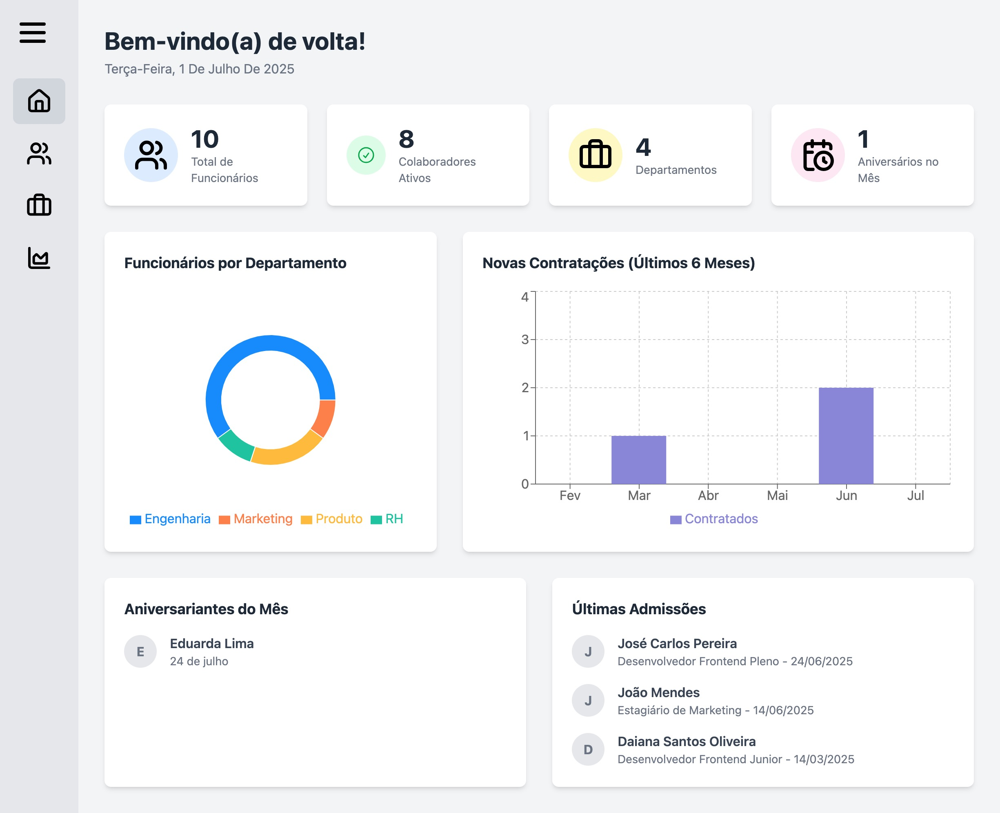
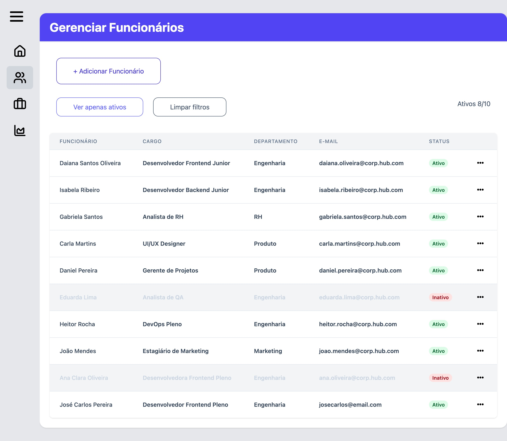
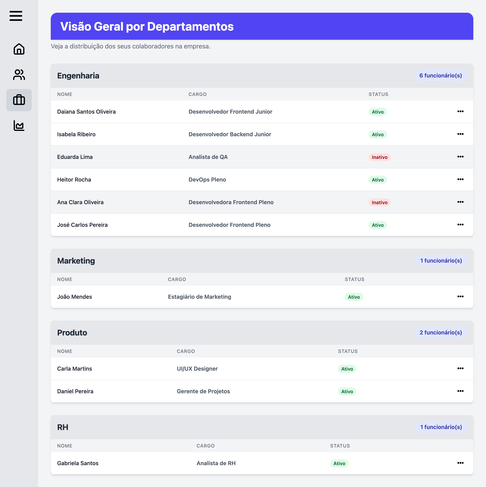
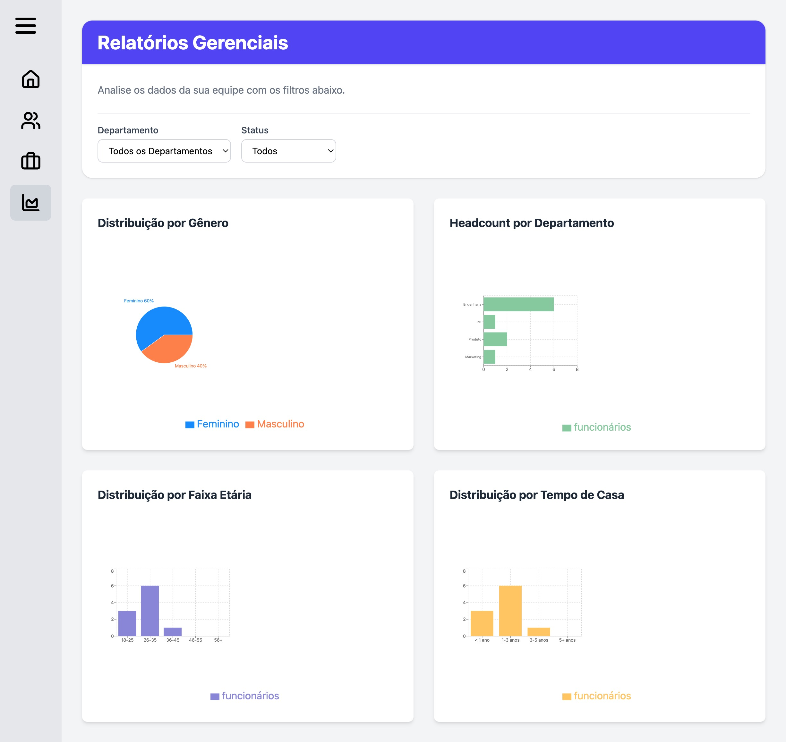

#  Team Hub

<br/>

<p align="center">
  
</p>

<p align="center">
  <b>Um sistema moderno e interativo para gerenciamento de recursos humanos.</b>
</p>

<p align="center">
  
  
  
  
  
</p>

---


## 🎯 Sobre o Projeto

**Team Hub** é uma aplicação web completa (Full Stack) projetada para ser um dashboard interno de Recursos Humanos (RH). A plataforma oferece uma visão centralizada e analítica da força de trabalho de uma empresa, permitindo não apenas a visualização de dados, mas também a gestão ativa dos colaboradores.

Este projeto foi construído do zero, abrangendo desde a criação de uma API RESTful segura com Node.js até uma interface de usuário reativa, moderna e responsiva com React e TypeScript.

<p align="center">
  
</p>

---

## ✨ Funcionalidades Principais

* **📊 Dashboard Principal:** Uma tela inicial com KPIs (Key Performance Indicators) que mostram rapidamente o total de funcionários, colaboradores ativos e outras métricas importantes. 
&nbsp;
* **👥 Gestão de Funcionários (CRUD):**
    * **Criação:** Formulário completo para adicionar novos funcionários, com validação de dados.
    * **Leitura:** Visualização de todos os funcionários em uma tabela organizada e com filtro.
    * **Atualização:** Edição de informações dos funcionários (como dados pessoais, cargo e departamento) por meio de um formulário interativo.
    * **Exclusão:** Funcionalidade para remover funcionários com um modal de confirmação para evitar ações acidentais.
&nbsp;
* **🏢 Visão por Departamentos:** Uma página que agrupa os colaboradores por departamento, oferecendo uma visão clara da estrutura da equipe e permitindo a edição rápida dos funcionários a partir desta tela.

&nbsp;
* **📈 Página de Relatórios:** Um painel analítico com gráficos interativos (gerados com Recharts) sobre:
    * Distribuição por Gênero
    * Headcount por Departamento
    * Distribuição por Faixa Etária
    * Distribuição por Tempo de Casa (Antiguidade)
&nbsp;
* **Filtros Dinâmicos:** Os relatórios e listas podem ser filtrados em tempo real, proporcionando uma análise de dados segmentada e poderosa.
&nbsp;
* **Interface Responsiva:** Todos os componentes foram desenhados para funcionar perfeitamente em desktops, tablets e dispositivos móveis.
&nbsp;
<p align="center">
  
</p>

---

## 🛠️ Tecnologias Utilizadas

A aplicação é dividida em duas partes principais: o Backend e o Frontend.

### **Backend (API)**

* **Runtime:** Node.js
* **Linguagem:** TypeScript
* **Framework:** Express.js
* **Banco de Dados:** MongoDB
* **Gerenciamento de Ambiente:** `dotenv`

### **Frontend (UI)**

* **Framework:** React com Vite
* **Linguagem:** TypeScript
* **Gerenciamento de Estado Global:** Redux Toolkit
* **Estilização:** Tailwind CSS
* **Componentes de UI:** Ant Design (para Dropdowns, Modals, Messages)
* **Visualização de Dados:** Recharts (para os gráficos)
* **Formulários e Validação:** Formik e Yup

&nbsp;
<p align="center">
  
</p>

---

## 🚀 Como Executar o Projeto

Para executar este projeto localmente, você precisará ter o Node.js, npm (ou yarn) e o MongoDB instalados.

### **1. Configuração do Backend**

```bash
# Clone o repositório
git clone https://github.com/fernanda-vaz/team-hub.git

# Navegue até a pasta do backend
cd team-hub/backend

# Instale as dependências
npm install

# Crie um arquivo .env na raiz da pasta /backend e adicione as seguintes variáveis:
MONGO_CS=sua_connection_string_do_mongodb
MONGO_DB_NAME=nome_do_seu_banco_de_dados

# Inicie o servidor de desenvolvimento
npm run dev
```

O servidor estará rodando em http://localhost:3000

---
### 2. Configuração do Frontend

```bash
# Em um novo terminal, navegue até a pasta do frontend
cd team-hub/frontend

# Instale as dependências
npm install

# Crie um arquivo .env na raiz da pasta /frontend e adicione a seguinte variável:
VITE_API_BASE_URL=http://localhost:3000

# Inicie a aplicação React
npm run dev
```

A aplicação estará disponível em http://localhost:5173 (ou outra porta indicada pelo Vite)

---
## Licença
Este projeto está sob a licença MIT. Veja o arquivo LICENSE para mais detalhes.


## Autor
Feito com ❤️ por [Fernanda Vaz](https://github.com/fernanda-vaz)

---

<h2 align="left">Entre em contato!</h2>

###

<div align="left">
  <a href="mailto:fernandavazdev@gmail.com" target="_blank">
    
  </a>
     
  <a href="https://www.linkedin.com/in/vaz-fernanda" target="_blank">
    
  </a>

  <a href="https://wa.me/+5561985888005" target="_blank">
    
  </a>

  <a href="https://discord.com/users/.fernandavaz" target="_blank">
    


###
  </a>

</div>